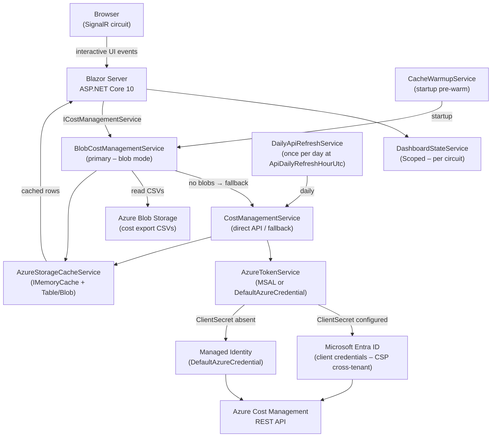
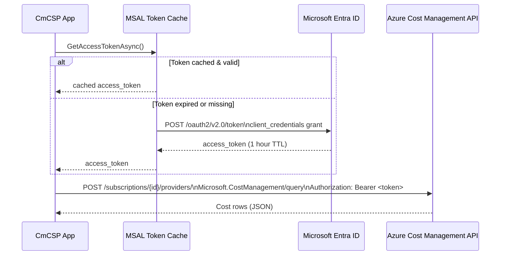
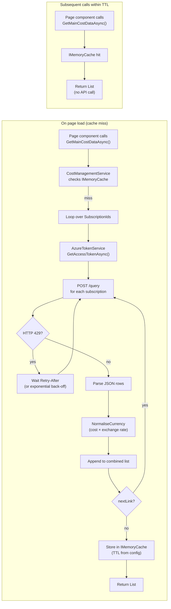
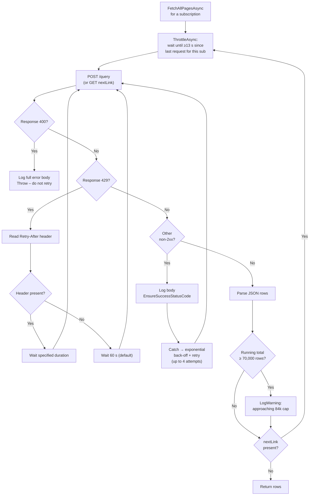
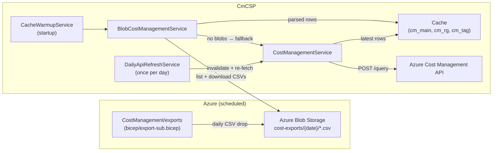
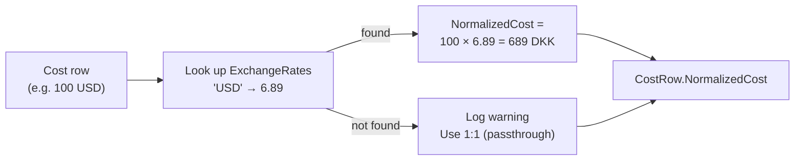
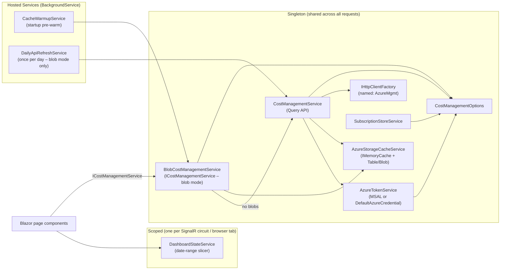

# CmCSP – Azure CSP Cost Dashboard

A **Blazor Server** web application that replaces a Power BI report with a live, interactive cost dashboard for Cloud Solution Provider (CSP) scenarios. It queries the **Azure Cost Management REST API** directly across multiple subscriptions, normalises costs to a configurable target currency, and caches results to respect API rate limits.

The dashboard mirrors the seven pages from the [TD SYNNEX tds_cc reference report](https://github.com/tdsnxnielsen-mikkelbach/tds_cc) and adds an eighth page for **Azure Advisor Overview** (health scores for all five Advisor categories plus detailed Cost recommendations), implemented with **MudBlazor** for the UI shell and **Blazor-ApexCharts** for charts.

Subscriptions can be added and removed at runtime from the **Home** page, with automatic cache invalidation and cross-page refresh. In blob-export mode, the app also reconciles export provisioning on startup for all active subscriptions and exposes a manual **Re-provision Export** action on the Home page for operator recovery. Every analytics page now includes a compact **subscription scope badge** showing selected subscriptions vs subscriptions with data for the current view.

---

## Table of Contents

1. [Architecture](#architecture)
2. [Project Structure](#project-structure)
3. [Prerequisites](#prerequisites)
4. [Getting Started](#getting-started)
5. [Configuration Reference](#configuration-reference)
6. [Azure Role Assignments](docs/azure-roles.md)
7. [CSP Deployment Guide](docs/csp-deployment-guide.md)
8. [User Authentication](#user-authentication)
9. [Authentication & Security](#authentication--security)
10. [Data Flow](#data-flow)
11. [Caching & Rate Limiting](#caching--rate-limiting)
12. [Blob Exports (Production)](#blob-exports-production)
13. [Currency Normalisation](#currency-normalisation)
14. [Dashboard Pages](#dashboard-pages)
15. [Advisor Overview](#advisor-overview)
16. [Service Registration](#service-registration)
17. [Deployment Notes](#deployment-notes)

---

## Architecture



---

## Project Structure

```
CmCSP/
├── .gitignore
├── README.md
├── appsettings.json                      ← base config (no secrets)
├── appsettings.Development.json          ← local overrides (git-ignored)
├── CmCSP.csproj
├── CmCSP.sln
├── GlobalUsings.cs                       ← Color/Align aliases (MudBlazor wins)
├── Program.cs                            ← DI registrations + HTTP pipeline
├── Properties/
│   └── launchSettings.json
├── Models/
│   ├── CostManagementOptions.cs          ← strongly-typed config section
│   ├── CostRow.cs                        ← one normalised cost record
│   ├── CostApiResponse.cs               ← Azure Cost Management + Consumption Budget + Advisor API response shapes
│   ├── SubscriptionBudget.cs            ← per-subscription budget record (from Consumption Budgets API)
│   ├── AdvisorRecommendation.cs         ← one Advisor Cost recommendation (normalised to TargetCurrency)
│   └── AdvisorCategoryScore.cs          ← one Advisor category health score per subscription
├── Services/
│   ├── AzureTokenService.cs              ← MSAL (ClientSecret) or DefaultAzureCredential fallback
│   ├── ICostManagementService.cs
│   ├── CostManagementService.cs          ← Query API: fetch / cache / normalise / retry
│   ├── BlobCostManagementService.cs      ← Blob Export: read CSVs; falls back to API if no blobs
│   ├── AzureStorageCacheService.cs       ← Table+Blob distributed cache (wraps IMemoryCache)
│   ├── DataLoadingStateService.cs        ← tracks per-dataset load phase for the UI
│   ├── CacheWarmupService.cs             ← background pre-warm on startup
│   ├── DailyApiRefreshService.cs         ← calls Query API once per day for latest data
│   ├── ExportProvisioningService.cs      ← reuses or creates subscription export + grants storage role
│   ├── SubscriptionExportReconcileService.cs ← startup reconciliation for export provisioning on active subscriptions
│   ├── SubscriptionStoreService.cs       ← persists user-added subscription IDs to Key Vault + disk
│   └── DashboardStateService.cs         ← shared date-range slicer (Scoped)
├── Components/
│   ├── App.razor                         ← HTML shell (MudBlazor + ApexCharts JS)
│   ├── _Imports.razor                    ← global Razor usings + type aliases
│   ├── Routes.razor
│   ├── Layout/
│   │   ├── MainLayout.razor              ← MudLayout, AppBar, Drawer, dark mode, global date-range picker, subscription chip
│   │   ├── NavMenu.razor                 ← 8 MudNavLinks + Refresh Data button
│   │   └── ReconnectModal.razor
│   ├── Pages/
│   │   ├── _Imports.razor                ← applies [Authorize] to every page in this folder
│   │   ├── Home.razor                    ← Page 1: Cost Overview
│   │   ├── Budgets.razor                 ← Page 2: Budgets
│   │   ├── SubscriptionBreakdown.razor   ← Page 3: Subscription Breakdown
│   │   ├── ResourceGroupBreakdown.razor  ← Page 4: Resource Group Breakdown
│   │   ├── TagChargeback.razor           ← Page 5: Tag Chargeback
│   │   ├── TrendAndForecast.razor        ← Page 6: Trend & Forecast
│   │   ├── MoMWaterfall.razor            ← Page 7: MoM Waterfall
│   │   ├── Advisor.razor                 ← Page 8: Advisor Overview (scores + Cost recommendations)
│   │   ├── Error.razor
│   │   └── NotFound.razor
│   └── Shared/
│       ├── LoadingStatus.razor           ← data-load progress banner
│       ├── SubscriptionScopeBadge.razor  ← selected vs with-data subscription scope indicator
│       └── RedirectToLogin.razor         ← forces unauthenticated users to /login outside SignalR
├── bicep/
│   ├── main.bicep                        ← export storage account + Table Storage + role assignments
│   ├── app.bicep                         ← Container App, ACR, Key Vault, Log Analytics (app RG)
│   ├── export-sub.bicep                  ← subscription-scope export (managed identity)
│   └── export-billing.bicep             ← billing-account-scope export (SAS token)
├── docs/
│   ├── azure-roles.md                   ← RBAC guide for all identities
│   └── csp-deployment-guide.md         ← step-by-step deployment guide for CSPs
└── wwwroot/
    ├── app.css
    └── apexcharts-theme.js               ← propagates MudBlazor dark/light toggle to ApexCharts
```

---

## Prerequisites

| Requirement | Minimum version |
|---|---|
| .NET SDK | 10.0 |
| Azure subscription(s) | With `Cost Management Contributor` assigned to the service principal (enables export auto-provisioning; `Cost Management Reader` is sufficient for Query API–only mode) |
| Microsoft Entra ID | App registration with a client secret |
| *(Blob mode only)* Azure Storage account | Created by `bicep/main.bicep` |
| *(Blob mode only)* Cost Management Export | Created or reused automatically by the app, reconciled on startup for active subscriptions, or created manually via `bicep/export-sub.bicep` |

See [docs/azure-roles.md](docs/azure-roles.md) for the exact role assignments required for each mode.

---

## Getting Started

### 1 – Clone and restore

```bash
git clone <your-repo-url>
cd CmCSP
dotnet restore
```

### 2 – Create an Entra app registration

1. Go to **Azure Portal → Microsoft Entra ID → App registrations → New registration**
2. Name it (e.g. `cmcsp-dashboard`), single-tenant, no redirect URI needed
3. Copy the **Application (client) ID** and **Directory (tenant) ID**
4. Under **Certificates & secrets**, create a new **Client secret** and copy the value immediately
5. For each subscription, open **Access control (IAM)** and assign **Cost Management Reader** to the app

### 3 – Set local secrets with dotnet user-secrets

`dotnet user-secrets` stores credentials in your OS user profile (`%APPDATA%\Microsoft\UserSecrets\` on Windows, `~/.microsoft/usersecrets/` on Linux/macOS) — completely outside the repository. They are never committed to git.

**Step 1 – Initialise the secrets store** (one-time per project):

```bash
cd CmCSP
dotnet user-secrets init
```

You will see output like:
```
Set UserSecretsId to '<guid>' for MSBuild project 'CmCSP.csproj'.
```

**Step 2 – Set each secret** (replace the placeholder values):

```bash
dotnet user-secrets set "AzureCostManagement:TenantId"          "<your-entra-tenant-id>"
dotnet user-secrets set "AzureCostManagement:ClientId"          "<your-app-client-id>"
dotnet user-secrets set "AzureCostManagement:ClientSecret"      "<your-client-secret>"
dotnet user-secrets set "AzureCostManagement:SubscriptionIds:0" "<subscription-id-1>"
dotnet user-secrets set "AzureCostManagement:SubscriptionIds:1" "<subscription-id-2>"
```

Add as many `SubscriptionIds:N` entries as needed (0-based index).

**Step 3 – Verify** the keys were saved (values are shown in plain text locally):

```bash
dotnet user-secrets list
```

Expected output:
```
AzureCostManagement:TenantId          = f8e9efa8-...
AzureCostManagement:ClientId          = 423c9464-...
AzureCostManagement:ClientSecret      = RxH8Q~...
AzureCostManagement:SubscriptionIds:0 = ba99b95e-...
```

**How configuration layering works at runtime:**

```
appsettings.json          (base – committed, no secrets)
  ↓ overrides
appsettings.Development.json  (dev tweaks – committed, no secrets)
  ↓ overrides
dotnet user-secrets       (local machine only – never committed)
  ↓ overrides
Environment variables     (CI / production)
```

**To remove a secret:**

```bash
dotnet user-secrets remove "AzureCostManagement:ClientSecret"
```

**To clear all secrets for this project:**

```bash
dotnet user-secrets clear
```

### 4 – Run

```bash
dotnet run
```

Open `https://localhost:7xxx` (the exact port is shown in terminal output).

---

## Configuration Reference

All settings live under the `AzureCostManagement` section in `appsettings.json`. Sensitive values must be supplied via `dotnet user-secrets` (development) or environment variables / Azure Key Vault (production).

| Key | Type | Default | Description |
|---|---|---|---|
| `Instance` | string | `https://login.microsoftonline.com/` | Entra authority base URL. Override only for sovereign clouds (e.g. Azure Government). |
| `TenantId` | string | — | Entra Directory (tenant) ID |
| `ClientId` | string | — | App registration Application ID |
| `ClientSecret` | string | — | **Use user-secrets or Key Vault – never commit** |
| `SubscriptionIds` | string[] | `[]` | List of subscription IDs to query |
| `TargetCurrency` | string | `DKK` | ISO 4217 currency code all costs are normalised to |
| `ExchangeRates` | object | see below | Map of `"CURRENCY": rate` where rate = target units per 1 source unit |
| `CacheExpirationMinutes` | int | `60` | How long API results are kept in memory |
| `MonthlyBudget` | decimal | `125000` | Legacy budget target in `TargetCurrency`. No longer consumed by the Budgets page (which now reads live budgets from the Azure Consumption API); retained for potential custom extensions. |
| `ApiVersion` | string | `2025-03-01` | Azure Cost Management API version |
| `ApiDailyRefreshHourUtc` | int | `0` | UTC hour (0–23) for the daily background API refresh (blob mode only). Set to e.g. `1` to refresh at 01:00 UTC, after the nightly export has typically landed. |
| `ExportBlob:Enabled` | bool | `false` | `true` = serve data from blob CSVs (production recommended) |
| `ExportBlob:StorageAccountUri` | string | — | `https://<account>.blob.core.windows.net` — uses `DefaultAzureCredential` |
| `ExportBlob:ConnectionString` | string | — | Alternative to URI for local dev without `az login` |
| `ExportBlob:ContainerName` | string | `cost-exports` | Blob container that receives the export files |
| `ExportBlob:BlobPrefix` | string | `exports` | Root folder path inside the container |
| `ExportBlob:StorageAccountResourceId` | string | — | ARM resource ID of the storage account (e.g. `/subscriptions/{id}/resourceGroups/{rg}/providers/Microsoft.Storage/storageAccounts/{name}`). Required for `ExportProvisioningService` to automatically grant the export managed identity write access when a subscription is added via the UI. |
| `AzureCache:Enabled` | bool | `false` | `true` = persist cache in Azure Table + Blob Storage (multi-replica safe) |
| `AzureCache:StorageAccountUri` | string | — | Base URI of the storage account used for the distributed cache |
| `AzureCache:TableName` | string | `cmcspcache` | Azure Table used for small cache payloads (≤ 64 KB) |
| `AzureCache:CacheContainerName` | string | `cmcspcache` | Blob container used for large cache payloads (> 64 KB) |

The following key lives at the **root** of the configuration (not under `AzureCostManagement`):

| Key | Type | Default | Description |
|---|---|---|---|
| `KeyVaultUri` | string | — | URI of the Azure Key Vault (e.g. `https://<vault>.vault.azure.net/`). When set, `SubscriptionStoreService` persists user-added subscription IDs to Key Vault secret `CmCSP--UserSubscriptionIds`, ensuring they survive container restarts and scale-out. Requires the Container App MI to have **Key Vault Secrets Officer** on the vault. |

Default exchange rates (override in `appsettings.json` or user-secrets):

```json
"ExchangeRates": {
  "USD": 6.89,
  "EUR": 7.46,
  "GBP": 8.72,
  "SEK": 0.67,
  "NOK": 0.65
}
```

---

## User Authentication

The dashboard is protected by **Entra ID (OIDC)** login — every page requires an authenticated user. The same app registration already used for the Cost Management API doubles as the identity provider; no second app registration is needed.

### How it works

```
Browser                      CmCSP app                 Entra ID
  │  GET /dashboard              │                          │
  │ ─────────────────────────── ►│                          │
  │                              │  (no auth cookie)        │
  │  302 → /login?redirectUri=.. │                          │
  │ ◄─────────────────────────── │                          │
  │  GET /login                  │                          │
  │ ─────────────────────────── ►│                          │
  │                              │ OIDC challenge           │
  │  302 → login.microsoftonline.com                        │
  │ ──────────────────────────────────────────────────────► │
  │  (user logs in / consents)                              │
  │  POST /signin-oidc (code)    │                          │
  │ ─────────────────────────── ►│ code exchange            │
  │                              │ ────────────────────── ► │
  │                              │ ◄──── id_token ──────── │
  │  Set-Cookie: auth            │                          │
  │ ◄─────────────────────────── │                          │
  │  302 → /dashboard            │                          │
```

`Microsoft.Identity.Web` handles token validation, cookie encryption, and token refresh automatically.

### Entra app registration — required configuration

These changes must be made in **Azure Portal → Microsoft Entra ID → App registrations → {your app} → Authentication**.

#### 1 – Add a Web platform (if not already present)

Under **Platform configurations**, click **Add a platform → Web**.

#### 2 – Add redirect URIs

| Environment | Redirect URI |
|---|---|
| Local dev (HTTPS) | `https://localhost:7105/signin-oidc` |
| Local dev (HTTP) | `http://localhost:5106/signin-oidc` |
| Azure (Container Apps) | `https://<container-app-fqdn>/signin-oidc` |

> The FQDN is the output of `deploy.ps1` (`containerAppFqdn`) and looks like  
> `cmcsp.<random>.swedencentral.azurecontainerapps.io`.

#### 3 – Add a front-channel logout URL (optional but recommended)

Set **Front-channel logout URL** to `https://<container-app-fqdn>/signout-callback-oidc`.

#### 4 – Token settings

Under **Implicit grant and hybrid flows** — leave both **Access tokens** and **ID tokens** unchecked. The app explicitly overrides `response_type` to `code` only (see `Program.cs` — the `Configure<OpenIdConnectOptions>` call), which means Entra never requests an `id_token` in the browser redirect. If ID tokens were accidentally enabled and the app were configured otherwise, Entra would return `AADSTS700054`.

#### 5 – No extra API permissions needed

The existing `Cost Management Reader` role assignment on each subscription already provides the required access. No additional Delegated or Application permissions are needed on the app registration itself for user login.

### Quick setup via Azure CLI

```bash
APP_ID="<your-app-client-id>"
LOCAL_HTTPS="https://localhost:7105/signin-oidc"
LOCAL_HTTP="http://localhost:5106/signin-oidc"
PROD_URI="https://<container-app-fqdn>/signin-oidc"

# Add all three redirect URIs at once
az ad app update --id "$APP_ID" \
  --web-redirect-uris "$LOCAL_HTTPS" "$LOCAL_HTTP" "$PROD_URI"
```

### Local development

No extra secrets are needed — the same `AzureCostManagement` user-secrets used for the cost API are also used for authentication:

```bash
dotnet user-secrets set "AzureCostManagement:TenantId"     "<tenant-id>"
dotnet user-secrets set "AzureCostManagement:ClientId"     "<client-id>"
dotnet user-secrets set "AzureCostManagement:ClientSecret" "<client-secret>"
```

Start the app with the `https` profile (required for OIDC cookies):

```bash
dotnet run --launch-profile https
```

### Controlling who can sign in

By default anyone in the tenant can sign in (the app is single-tenant). To restrict access:

- **Option A – App roles** (recommended for fine-grained control): Add an app role in the manifest, assign users/groups to the role, and add `[Authorize(Roles = "...")]` to pages or the route view.
- **Option B – Group-based access control**: Assign a security group to the app registration under **Enterprise applications → Users and groups**.

---

## Authentication & Security



**Security practices applied:**

- `ClientSecret` is never present in source-controlled files (`appsettings.Development.json` is git-ignored)
- In production (Container Apps), `ClientSecret` is stored in **Azure Key Vault** and injected at runtime via a Container App secret reference — never as a plain env var
- `AzureTokenService` is registered as **Singleton** — MSAL's internal cache handles token renewal automatically
- When `ClientSecret` is not configured (e.g. local dev with `az login`), `AzureTokenService` automatically falls back to `DefaultAzureCredential` (Managed Identity in Azure, az login locally)
- **CSP note:** The Entra app with `ClientSecret` is required for CSP resellers to query customer subscriptions from their own tenant. The Container App's Managed Identity alone does not have cross-tenant Cost Management rights.
- The named `HttpClient` (`"AzureMgmt"`) has a 90-second timeout; no ambient credentials are stored on it — the bearer token is added per-request
- Roles follow least-privilege: **Cost Management Reader** only (read-only)

---

## Data Flow



### Three independent datasets

| Cache key | API grouping | Used by pages |
|---|---|---|
| `cm_main` | SubscriptionName + MeterCategory | Cost Overview, Budgets, Subscriptions, Trend, MoM |
| `cm_rg` | SubscriptionName + ResourceGroupName | Resource Group Breakdown |
| `cm_tag` | SubscriptionName + TagKey | Tag Chargeback |
| `cm_advisor` | Advisor Cost recommendations per subscription | Advisor Overview |
| `cm_advisor_scores` | Advisor category health scores per subscription | Advisor Overview |
| `cm_sub_names` | Subscription display names resolved from `/subscriptions/{id}` | Advisor Overview (charts/tables), subscription chip |
| `cm_budgets` | Per-subscription budgets from Consumption API | Budgets |

Calling `CostManagementService.InvalidateCache()` clears all keys, forcing a fresh API fetch on the next request.

### Runtime subscription updates and trace correlation

When a subscription is added, imported, or removed in **Home → Manage Subscriptions**:

1. `Home.razor` generates a single correlation ID for that user action.
2. `SubscriptionStoreService` persists the new subscription set and raises `OnChanged(correlationId)`.
3. `MainLayout.razor` receives the event, invalidates cache, and re-broadcasts `DashboardStateService` so open pages refresh.
4. `ExportProvisioningService` (blob mode) receives the same correlation ID for export creation and storage-role assignment logs.

This produces one end-to-end trace chain in log stream:

- `Home[<correlationId>] ...`
- `SubscriptionStore[<correlationId>] ...`
- `MainLayout[<correlationId>] ...`
- `ExportProvisioning[<correlationId>] ...`

---

## Caching & Rate Limiting

### Azure Cost Management API hard limits

Source: [learn.microsoft.com/azure/cost-management-billing/costs/manage-automation](https://learn.microsoft.com/azure/cost-management-billing/costs/manage-automation)

| Limit | Value | Effect if exceeded |
|---|---|---|
| Requests per minute per subscription (`/query`) | **5** | HTTP 429 + `Retry-After` header |
| Date range – daily granularity | **365 days** | HTTP 400 Bad Request |
| Date range – monthly granularity | **12 months** | HTTP 400 Bad Request |
| Response payload | **~84,000 rows** | Overflow delivered via `nextLink` pagination |

### How the service handles each limit



### Request pacing (`ThrottleAsync`)

Before every API call (including pagination), the service checks how long ago the last request was dispatched for that subscription. If less than **13 seconds** have elapsed it sleeps the difference.

- **5 req/min = 1 req per 12 s**; 13 s gives a comfortable margin.
- The gate is per-subscription, so multiple subscriptions run concurrently without interfering with each other.
- Pacing only fires during a cold-cache fill. Cache hits (the common case) bypass it entirely.

### Date range

The query window is always **today − 364 days → today** (exactly 365 days inclusive). This is the maximum the API accepts for daily granularity and is enforced by the `MaxQueryDays = 365` constant in `CostManagementService`.

### 400 Bad Request detection

HTTP 400 indicates a malformed or out-of-range query — retrying will not help. The service:

1. Reads and logs the full response body at `Error` level so you can see the Azure error message.
2. Throws `InvalidOperationException` immediately (caught and re-thrown before the retry loop).
3. The outer `FetchAllPagesAsync` catches and logs the exception, then skips that subscription rather than crashing the whole dashboard.

### Cache

| Parameter | Value | Location |
|---|---|---|
| Cache TTL (development) | 5 minutes | `appsettings.Development.json` |
| Cache TTL (production) | 60 minutes | `appsettings.json` |
| Cache keys | `cm_main`, `cm_rg`, `cm_tag`, `cm_budgets`, `cm_advisor`, `cm_advisor_scores`, `cm_sub_names` | `CostManagementService` constants |
| Max retries per request | 4 | `CostManagementService.MaxRetries` |
| Default rate-limit wait | 60 seconds | `CostManagementService.DefaultRetryDelay` |
| Exponential back-off base | 2^attempt seconds | Non-429 transient errors |
| Minimum request interval | 13 seconds | `CostManagementService.MinRequestInterval` |
| Row cap warning threshold | 70,000 rows | `CostManagementService.RowCapWarning` |

---

## Blob Exports (Production)

The Blob Export mode is an alternative to the Query API that eliminates rate limits and is the recommended approach for production deployments.

### How it works



### No-blob fallback

If no export blobs are found (e.g. the scheduled export has not yet run), `BlobCostManagementService` automatically falls back to `CostManagementService` and queries the Azure Cost Management API directly. This means the dashboard shows live data from day one, without waiting for the first export to land.

### MonthToDate cumulative exports — deduplication

Azure Cost Management exports of type `MonthToDate` write a **new cumulative CSV** every day — each daily run re-exports all data from the 1st of the month through that run date. Without deduplication, reading 18 blobs on May 18 would count May 1's cost 18 times, May 2's 17 times, etc., inflating the MTD figure by roughly 11×.

`BlobCostManagementService` handles this by processing each blob into its own temporary accumulator and then merging with **replacement** semantics into the main accumulator (blobs are sorted oldest-first so the most recent run always wins). This means:

- Within a single blob, multiple rows for the same `date|sub|meterCategory` key are summed (correct — different resources sharing a meter category).
- Across blobs, the newest blob's value for a given key replaces any earlier blob's value (correct — the latest run has the most up-to-date cost).

### Daily API refresh

Blob exports are historical — they land once per day and reflect the previous day's finalised billing data. To ensure dashboards always show the most up-to-date figures, `DailyApiRefreshService` calls the Cost Management API once per day at a configurable UTC hour:

- The refresh hour is controlled by `AzureCostManagement:ApiDailyRefreshHourUtc` (default `0` = midnight UTC).
- The service invalidates the cache and re-fetches all three datasets from the API sequentially.
- For the next `CacheExpirationMinutes` (default 60 min) all requests are served the fresh API data; after that, `BlobCostManagementService` resumes serving from blob exports as normal.

Set `AzureCostManagement__ApiDailyRefreshHourUtc=1` (for 01:00 UTC) to schedule the refresh after the nightly export has typically landed, ensuring maximum data completeness.

### Manual cache refresh

A **Refresh Data** button in the navigation sidebar calls `ICostManagementService.InvalidateCache()` and immediately triggers all pages to re-fetch. Use it after forcing an export run from the Azure portal, or after deploying a new image, to see fresh data without waiting for the 60-minute cache TTL to expire.

### Switching to blob mode

1. Deploy the storage infrastructure:
   ```bash
   az deployment group create \
     --resource-group rg-cmcsp-app \
     --template-file bicep/main.bicep \
     --parameters storageAccountName=cmcspcostexports
   ```
2. Deploy the export schedule per subscription (or let the UI do it automatically — see below):
   ```bash
   az deployment sub create \
     --location swedencentral \
     --template-file bicep/export-sub.bicep \
     --parameters exportName=daily-cost-export \
       storageAccountResourceId="<id>" \
       recurrenceFrom="2026-01-01T02:00:00Z"
   ```
3. Grant the export managed identity `Storage Blob Data Contributor` (see step 3 in [docs/azure-roles.md](docs/azure-roles.md)).
4. Grant the application identity `Storage Blob Data Reader` on the storage account.
5. Set configuration (via user-secrets locally, environment variables in production):
   ```
   AzureCostManagement:ExportBlob:Enabled                = true
   AzureCostManagement:ExportBlob:StorageAccountUri      = https://<account>.blob.core.windows.net
   AzureCostManagement:ExportBlob:StorageAccountResourceId = /subscriptions/{id}/resourceGroups/{rg}/providers/Microsoft.Storage/storageAccounts/{name}
   KeyVaultUri                                           = https://<vault>.vault.azure.net/
   ```

### Automated export provisioning

When `ExportBlob:Enabled = true` and `ExportBlob:StorageAccountResourceId` is configured, adding a subscription via the **Manage Subscriptions** panel on the Home page automatically:

1. Creates a `cmcsp-daily-export` Cost Management export on the new subscription (using the Entra App SP — requires `Cost Management Contributor` on the subscription).
2. Grants `Storage Blob Data Contributor` on the storage account to the export's managed identity (using the Container App MI — requires `User Access Administrator` on the storage account, granted by `bicep/main.bicep`).

The provisioning runs in the background; the subscription is immediately active for Query API while the export is being set up. Errors are logged to the container's application log stream.

The **subscription display name** (e.g. "Contoso Azure") is shown in the chip immediately after adding, with the GUID available as a tooltip.

### Configuration keys

| Key | Description |
|---|---|
| `ExportBlob:Enabled` | `true` = use blobs, `false` (default) = use Query API |
| `ExportBlob:StorageAccountUri` | Full URI of the storage account; uses `DefaultAzureCredential` |
| `ExportBlob:ConnectionString` | Alternative to URI; use user-secrets only |
| `ExportBlob:ContainerName` | Blob container name (default: `cost-exports`) |
| `ExportBlob:BlobPrefix` | Root folder path inside the container (default: `exports`) |
| `ExportBlob:StorageAccountResourceId` | ARM resource ID of the storage account. Required for automated export provisioning (see below). |

### Automated export provisioning

When `ExportBlob:Enabled = true` and `ExportBlob:StorageAccountResourceId` is configured, adding a subscription via the **Manage Subscriptions** panel on the Home page automatically:

1. Creates a `cmcsp-daily-export` Cost Management export on the new subscription (using the Entra App SP — requires `Cost Management Contributor` on the subscription).
2. Grants `Storage Blob Data Contributor` on the storage account to the export’s managed identity (using the Container App MI — requires `User Access Administrator` on the storage account, granted by `bicep/main.bicep`).

The provisioning runs in the background; the subscription is immediately active for Query API while the export is being set up. Errors are logged to the container’s application log stream.

The **subscription display name** (e.g. “Contoso Azure”) is resolved via the ARM `/subscriptions/{id}` endpoint and shown in the chip immediately after adding, with the GUID available as a tooltip.

### CSP export column compatibility

Azure Cost Management exports for CSP billing accounts use the column name `billingCurrency` rather than the EA-format `billingCurrencyCode`. `BlobCostManagementService` probes in priority order: `billingcurrencycode` → `currency` → `billingcurrency`. If none is found, costs are assumed to already be in the target currency (safe for single-currency CSP tenants).

### Bootstrapping historical data

A fresh export deployment only covers the **current calendar month** (`timeframe=MonthToDate`). To pre-populate the full 12-month rolling window, pass `-HistoricalMonths` to `deploy.ps1` (requires `-DeployExports`):

```powershell
.\scripts\deploy.ps1 ... -DeployExports -HistoricalMonths 12
```

This creates one inactive Custom-timeframe export per prior calendar month (named `<ExportName>-hist-yyyy-MM`) and immediately triggers each via the Cost Management API. Once all have run, the blobs appear under the `exports/` prefix and the app loads the full history on its next cache refresh.

### Comparison with Query API mode

| | Query API | Blob Exports |
|---|---|---|
| Rate limit | 5 req/min per subscription | None (blob reads) |
| Data freshness | ~2–4 h behind real time | ~24 h (last export run) + API refresh once/day |
| Historic depth | 365 days per request | All accumulated export files |
| Secrets required | `ClientSecret` (CSP cross-tenant) | None for blobs (Managed Identity); `ClientSecret` used for daily API refresh |
| Infrastructure | None | Storage account + export resource |
| No-data fallback | — | Automatically falls back to Query API if no blobs exist |

---

## Currency Normalisation

The Cost Management API returns costs in each subscription's **billing currency**, which may differ between subscriptions (USD, EUR, GBP, etc.). Every `CostRow` has two cost fields:

| Field | Description |
|---|---|
| `Cost` | Raw value in the original billing currency |
| `Currency` | ISO 4217 code returned by the API (e.g. `"USD"`) |
| `NormalizedCost` | Cost converted to `TargetCurrency` using the exchange rate table |

All charts and cards display `NormalizedCost`. If a currency is encountered that has no configured exchange rate, a warning is logged and a 1:1 rate is used — update `ExchangeRates` in `appsettings.json` to fix this.

> **Chart Y-axis formatting:** All cost charts format Y-axis labels to two decimal places using an ApexCharts JS formatter (`val.toFixed(2)`). This prevents the full C# `decimal` precision (e.g. `30.000000000000`) from appearing on chart axes. The radial-bar gauge on the Budgets page uses the same formatter with a `%` suffix (`parseFloat(val).toFixed(2) + '%'`). On the Tag Chargeback page the vertical bar uses a `Yaxis` formatter and the horizontal ranked bar uses an `Xaxis` formatter (the value axis flips when `Horizontal = true`).

> **Dark mode:** The AppBar toggle propagates MudBlazor's dark/light theme to all mounted ApexCharts instances in real time via `wwwroot/apexcharts-theme.js`, which calls `ApexCharts.exec()` on each chart and sets `window.Apex.theme` so charts created after a Blazor navigation also use the correct mode.



---

## Dashboard Pages

All analytics pages display a shared **SubscriptionScopeBadge** just below the page title:

- `selected`: active subscriptions currently configured in `SubscriptionStoreService`
- `with data`: subscriptions that produced rows for the page's current dataset/filter

This makes multi-subscription coverage explicit, including subscriptions that are selected but currently have zero cost for a view.

### Page 1 – Cost Overview (`/`)

| Visual | Type | Data source |
|---|---|---|
| Total Cost (selected range) | KPI card | `cm_main` |
| Cost MTD | KPI card | `cm_main` |
| Cost YTD | KPI card | `cm_main` |
| Avg Daily Cost | KPI card | `cm_main` |
| Current vs Prior Month | Dual-line ApexChart | `cm_main` grouped by day |
| Monthly Cost Trend | Bar ApexChart | `cm_main` grouped by month |
| Top 10 Services | Horizontal bar ApexChart | `cm_main` grouped by MeterCategory |

**Date filter:** responds to global `DashboardStateService.SelectedRange`.

---

### Page 2 – Budgets (`/budgets`)

Reads subscription-scope budgets from the **Azure Consumption Budgets API** (`GET /subscriptions/{id}/providers/Microsoft.Consumption/budgets`). Only subscriptions that have at least one budget configured in Azure are shown; if no subscription has a budget defined, an informational message is displayed instead of empty charts.

| Visual | Type | Data source |
|---|---|---|
| Total Budget | KPI card | Sum of all `SubscriptionBudget.Amount` (normalised to `TargetCurrency`) |
| Current Period Spend | KPI card | MTD spend from `cm_main` (current calendar month); falls back to API `currentSpend` only when no cost rows exist for a given subscription |
| Budget Variance | KPI card (red/green) | `CurrentSpend − TotalBudget` |
| Budget Variance % | KPI card | `(Variance / TotalBudget) × 100` |
| Spend vs Budget | Radial bar (gauge) | Aggregate % of total budget consumed in current period |
| Budget vs Current Spend by Subscription | Grouped bar ApexChart | Per-subscription budget amount vs MTD spend from `cm_main` |
| Monthly Spend vs Total Budget | Bar + line ApexChart | Last 6 months historical spend from `cm_main`; budget line = `TotalBudget` |

Budget data is cached under `cm_budgets` with the same TTL as other datasets. `InvalidateCache()` clears it together with `cm_main`, `cm_rg`, `cm_tag`.

> **CSP note:** `Cost Management Reader` at the subscription scope (already assigned for cost data) is sufficient to read subscription-scope budgets. No additional role assignment is required.
>
> **CSP spend reliability:** The Consumption Budgets API `currentSpend` field is unreliable for CSP cross-tenant subscriptions (frequently returns `null` or `0`). The Budgets page therefore computes month-to-date spend directly from `cm_main` cost rows. The API value is only used as a fallback for subscriptions that have a budget but no cost rows in `cm_main`.

---

### Page 3 – Subscription Breakdown (`/subscriptions`)

| Visual | Type | Data source |
|---|---|---|
| Total Cost | KPI card | `cm_main` |
| Subscription count | KPI card | distinct `SubscriptionName` |
| Largest share % | KPI card | top subscription share |
| Cost by Subscription | Horizontal bar ApexChart | `cm_main` per subscription |
| Cost Share | Donut ApexChart | `cm_main` per subscription |
| Subscription Reference | MudDataGrid | ID, Name, Total, MTD, Share % |

---

### Page 4 – Resource Group Breakdown (`/resource-groups`)

| Visual | Type | Data source |
|---|---|---|
| Total Cost | KPI card | `cm_rg` |
| Resource group count | KPI card | `cm_rg` |
| Avg Monthly Cost (top 15) | KPI card | `cm_rg` |
| Top 15 Resource Groups | Horizontal bar ApexChart | `cm_rg` top 15 by cost |
| Details table | MudDataGrid | Name, Total, MTD, Share % |

---

### Page 5 – Tag Chargeback (`/tags`)

| Visual | Type | Data source |
|---|---|---|
| Total Tagged Cost | KPI card | `cm_tag` (non-empty TagKey) |
| Untagged Cost | KPI card | `cm_tag` (empty TagKey) |
| Distinct Tag Keys | KPI card | `cm_tag` |
| Cost Distribution by Tag | Vertical bar ApexChart | `cm_tag` |
| Tag Cost Ranked | Horizontal bar ApexChart | `cm_tag` |
| Tag Reference Table | MudDataGrid | Tag, Total Cost, Share % |

> **Note:** The API groups by `TagKey` (key names only). Tag values are not included in this grouping level.

> **CSP API limitation:** For CSP cross-tenant subscriptions, the `TagKey` dimension from the Cost Management Query API may return empty results even when resources are tagged, because tag metadata ingestion into the billing pipeline is less reliable in CSP scenarios than in EA/MCA. Blob exports are the reliable source for tag data — the `tags` CSV column is sourced directly from Azure Resource Manager metadata at export time and will correctly reflect all tagged resources once exports have run.

> **API mode notice:** When `ExportBlob:Enabled = false` (direct API mode), the Tag Chargeback page shows an informational banner explaining that tag data is only available in blob export mode and directing to `bicep/export-sub.bicep`. The four KPI cards and charts are hidden until blob exports are configured and have run at least once.

---

### Page 6 – Trend & Forecast (`/trend`)

| Visual | Type | Data source |
|---|---|---|
| Cost MTD | KPI card | `cm_main` |
| Month-End Forecast | KPI card | `(MTD / daysElapsed) × daysInMonth` |
| Rolling 3-Month Avg | KPI card | last 3 calendar months |
| YoY Change % | KPI card | current year vs prior year |
| Actual vs Forecast (daily) | Dual-line ApexChart | actual daily + projected remaining |
| Monthly + Rolling 3M Avg | Grouped bar + line ApexChart | `cm_main` monthly |
| YoY Comparison | Dual-line ApexChart | current year vs prior year by month |

**Forecast method:** simple linear extrapolation — `averageDailySpend × daysInMonth`. This gives a sensible first-order estimate without requiring historical ML models.

---

### Page 7 – MoM Waterfall (`/waterfall`)

| Visual | Type | Data source |
|---|---|---|
| MoM Change | KPI card | `currentMonth − priorMonth` |
| MoM Change % | KPI card | `(currentMonth − priorMonth) / priorMonth` |
| YoY Change % | KPI card | same calendar month, prior year |
| Current Month Spend | KPI card | `cm_main` |
| MoM Cost Change (bar) | Bar ApexChart (green/red) | monthly delta series |
| MoM Change by Subscription | Horizontal bar (green/red) | current vs prior month per subscription |
| Monthly Summary | MudDataGrid | Month, Total, Change, Change % |

---

## Advisor Overview

### Page 8 – Advisor Overview (`/advisor`)

The page has two sections:

#### Section 1 – Advisor Health Scores

Fetches **all five Advisor category scores** for every configured subscription via `GET /subscriptions/{id}/providers/Microsoft.Advisor/advisorScore?api-version=2023-01-01` and displays them as colour-coded KPI cards (averaged across subscriptions).

| Category | API key | Colour coding |
|---|---|---|
| Cost | `cost` | ≥ 80 % green · 60–79 % amber · < 60 % red |
| Security | `security` | same |
| Reliability | `reliability` | same |
| Operational Excellence | `operationalExcellence` | same |
| Performance | `performance` | same |

A score of ~100 % (no open recommendations) is shown as **✓ No open recommendations**. Scores are cached under `cm_advisor_scores`.

An info callout beneath the cards explains why only Cost recommendations are detailed: Security and Reliability scores are provided for situational awareness, but the authoritative tools for acting on them are **Microsoft Defender for Cloud** and **Azure Monitor** respectively.

#### Section 2 – Cost Recommendations

Fetches **Azure Advisor Cost recommendations** for all configured subscriptions from the Advisor REST API (`GET /subscriptions/{id}/providers/Microsoft.Advisor/recommendations?$filter=Category eq 'Cost'`). Only the Cost category is requested — Security, Reliability, Performance, and OperationalExcellence recommendations are excluded to keep the dashboard focused on financial impact.

| Visual | Type | Data source |
|---|---|---|
| Total Potential Annual Savings | KPI card (green) | Sum of `NormalizedAnnualSavings` across all recommendations |
| High Impact | KPI card (red) | Count + aggregate saving for High impact recommendations |
| Medium Impact | KPI card (amber) | Count + aggregate saving for Medium impact recommendations |
| Low Impact | KPI card | Count + aggregate saving for Low impact recommendations |
| Potential Savings by Subscription | Horizontal bar ApexChart | `cm_advisor` grouped by `SubscriptionName` |
| Top Resource Types by Saving Opportunity | Horizontal bar ApexChart | `cm_advisor` grouped by `ImpactedField` (top 10) |
| All Cost Recommendations | MudDataGrid (filterable + sortable) | Subscription, Resource, Resource Type, Impact, Problem, Annual Saving |

**Date filter:** Advisor data is point-in-time (not time-series) — the global date-range picker does not filter this page. The page subscribes to `OnStateChanged` only to participate in the **Refresh Data** flow (which invalidates both `cm_advisor` and `cm_advisor_scores`).

**No-blobs behaviour:** Advisor data is always fetched via the REST API regardless of `ExportBlob:Enabled`. When running in blob mode, `BlobCostManagementService` delegates both `GetAdvisorRecommendationsAsync` and `GetAdvisorScoresAsync` directly to the underlying `CostManagementService`.

### Required permissions

Both the score and recommendation APIs require the **Reader** role on each subscription (in addition to the existing `Cost Management Reader`). See [docs/azure-roles.md](docs/azure-roles.md) for the full role assignment details.

### Subscription display names

Neither the score nor the recommendation API returns a subscription display name. `CostManagementService` resolves the name by calling `GET /subscriptions/{id}?api-version=2022-12-01` once per subscription during the cold-cache fetch. This call is not rate-limited. The resolved name is stored in `AdvisorRecommendation.SubscriptionName` / `AdvisorCategoryScore.SubscriptionName` and used in charts and tables.

---

## Service Registration

> **Global date-range filter**  
> `MainLayout.razor` renders a `MudDateRangePicker` at the top of every page. On first render it auto-detects the available date range by fetching `cm_main` (a near-instant cache hit after warmup) and calls `DashboardStateService.SetDateRange(min, max)`. A “Fit to data” button repeats this at any time. All pages read `DashboardStateService.SelectedRange` to filter their charts and tables, so changing the picker instantly updates every visible page.

> **Subscription chip**  
> `MainLayout.razor` also renders a **"N subscription(s) ▾"** chip next to the date-range picker. Clicking it expands an inline table listing each subscription's display name and ID. Names are resolved lazily on first expand via `GetSubscriptionDisplayNamesAsync()` and cached under `cm_sub_names`. The count comes from `SubscriptionStoreService.AllIds.Count` and updates immediately when subscriptions are added or removed at runtime.

> **Subscription change propagation**  
> `SubscriptionStoreService.OnChanged` now carries a correlation ID (`Action<string>`). `MainLayout.razor` uses this to log and trigger cache invalidation plus global state refresh. `Home.razor` logs the same correlation ID when it initiates the change, and `ExportProvisioningService` logs the same ID during auto-provisioning in blob mode.



**Why Singleton for the cost services?**  
`AzureStorageCacheService`, `IHttpClientFactory`, and `IMemoryCache` are all Singleton-safe. Singleton cost services mean the cache is shared across all browser sessions — one fetch per TTL regardless of user count.

**Why two cost services in blob mode?**  
`BlobCostManagementService` is registered as `ICostManagementService` (used by pages and `CacheWarmupService`). `CostManagementService` is also registered as its concrete type so `BlobCostManagementService` can inject it for no-blob fallback, and `DailyApiRefreshService` can call it directly for the daily refresh.

**Why Scoped for `DashboardStateService`?**  
Each browser tab has its own SignalR circuit. Scoping the state service to the circuit means each tab's date-range filter is independent.

---

## Resource Tags

All Azure resources created by the Bicep templates (`app.bicep`, `main.bicep`) receive tags via the shared `param tags object = {}` parameter. The `deploy.ps1` script applies this default tag set — override at call time with `-Tags @{...}`:

| Tag | Default value | Purpose |
|---|---|---|
| `project` | `cmcsp` | Project / workload identifier |
| `application` | `csp-cost-dashboard` | Deployed application name |
| `environment` | `production` | Deployment environment |
| `managed-by` | `bicep` | Indicates Bicep-managed resources |
| `owner` | `platform-engineering` | Team responsible for the resource |
| `cost-center` | `cloud-ops` | Billing / chargeback cost center |

To apply updated tags to an already-provisioned environment without a full redeploy:

```powershell
$tags = '{"project":"cmcsp","application":"csp-cost-dashboard","environment":"production","managed-by":"bicep","owner":"platform-engineering","cost-center":"cloud-ops"}'

# Storage
az deployment group create -g rg-cmcsp-app --name tag-update-main `
  --template-file bicep/main.bicep --mode Incremental --only-show-errors `
  --parameters storageAccountName=<storage-name> tags=$tags

# Container App, ACR, Key Vault, Log Analytics (pass through the current image to avoid reset)
$img = $(az containerapp show -n cmcsp -g rg-cmcsp-app --query 'properties.template.containers[0].image' -o tsv)
az deployment group create -g rg-cmcsp-app --name tag-update-app `
  --template-file bicep/app.bicep --mode Incremental --only-show-errors `
  --parameters acrName=<acr-name> keyVaultName=<kv-name> containerImage=$img tags=$tags
```

---

## Deployment Notes

### Environment variables (production)

Supply secrets via environment variables instead of `appsettings.Development.json`:

```bash
AzureCostManagement__TenantId=<value>
AzureCostManagement__ClientId=<value>
AzureCostManagement__ClientSecret=<value>
AzureCostManagement__SubscriptionIds__0=<sub-id-1>
AzureCostManagement__SubscriptionIds__1=<sub-id-2>
```

ASP.NET Core maps double-underscore (`__`) to the colon (`:`) separator in configuration keys.

### Azure Key Vault (recommended for production)

Add the `Azure.Extensions.AspNetCore.Configuration.Secrets` NuGet package and register Key Vault as a configuration provider in `Program.cs`. Map `AzureCostManagement--ClientSecret` (double dash = Key Vault separator convention) to the config path.

### Docker

```dockerfile
FROM mcr.microsoft.com/dotnet/aspnet:10.0 AS base
WORKDIR /app
EXPOSE 8080

FROM mcr.microsoft.com/dotnet/sdk:10.0 AS build
WORKDIR /src
COPY ["CmCSP.csproj", "."]
RUN dotnet restore
COPY . .
RUN dotnet publish -c Release -o /app/publish

FROM base AS final
WORKDIR /app
COPY --from=build /app/publish .
ENTRYPOINT ["dotnet", "CmCSP.dll"]
```

Pass secrets as environment variables to the container — never bake them into the image.

### Azure Container Apps

All configuration is managed through environment variables. Sensitive values (especially `ClientSecret`) are stored in **Azure Key Vault** and referenced via Container App secrets:

```bash
# Add the KV reference as a Container App secret
az containerapp secret set -n cmcsp -g rg-cmcsp-app \
  --secrets "client-secret=keyvaultref:https://<kv-name>.vault.azure.net/secrets/CmCSP--ClientSecret,identityref:system"

# Expose it as an environment variable
az containerapp update -n cmcsp -g rg-cmcsp-app \
  --set-env-vars "AzureCostManagement__ClientSecret=secretref:client-secret"
```

The `app.bicep` template already includes this wiring and the `Key Vault Secrets User` role assignment for the Container App's SystemAssigned Managed Identity. The `deploy.ps1` script (Phase 5–6) creates the Key Vault secret and wires it automatically.

**Note on authentication modes in Container Apps:**  
- The Container App's Managed Identity is used for blob storage and distributed cache access (`DefaultAzureCredential`)  
- `ClientSecret` is additionally required for the Cost Management Query API because CSP resellers query customer subscriptions from their own Entra tenant — a right that Managed Identity alone does not have

---

## NuGet Packages

| Package | Purpose |
|---|---|
| `MudBlazor` | UI component library (layout, cards, data grids, navigation, date pickers) |
| `Blazor-ApexCharts` | Interactive charts (line, bar, donut, radial bar) |
| `Microsoft.Identity.Web` | Entra ID OIDC authentication middleware – handles browser login, cookie encryption, and token validation |
| `Microsoft.Identity.Client` | MSAL – OAuth2 client-credentials token acquisition with built-in cache |
| `Azure.Storage.Blobs` | Read cost export CSV files from Azure Blob Storage (blob mode) |
| `Azure.Data.Tables` | Azure Table Storage client – used by `AzureStorageCacheService` to persist small cache payloads across Container App replicas |
| `Azure.Identity` | `DefaultAzureCredential` – managed identity / az login for blob and table authentication |
