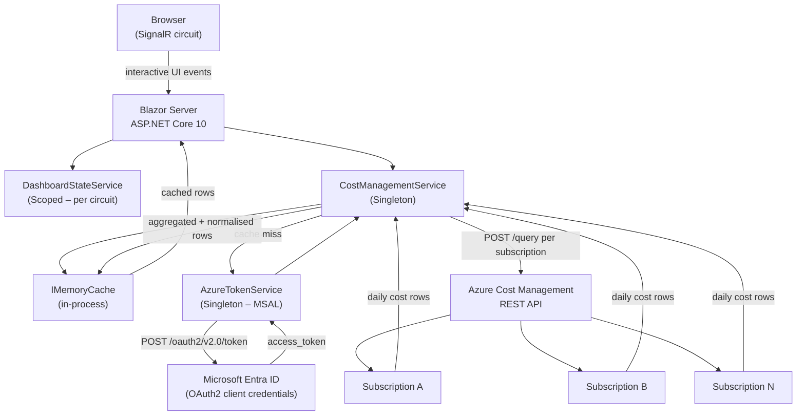
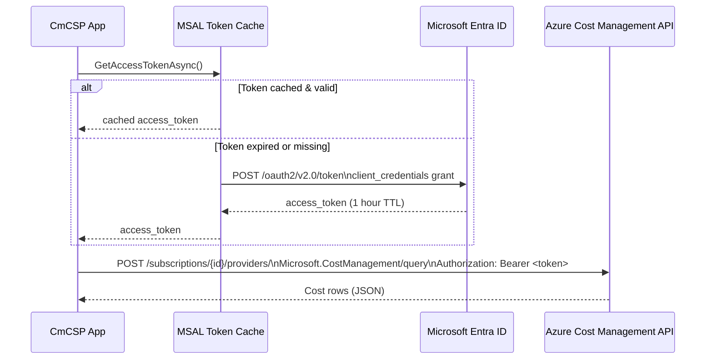
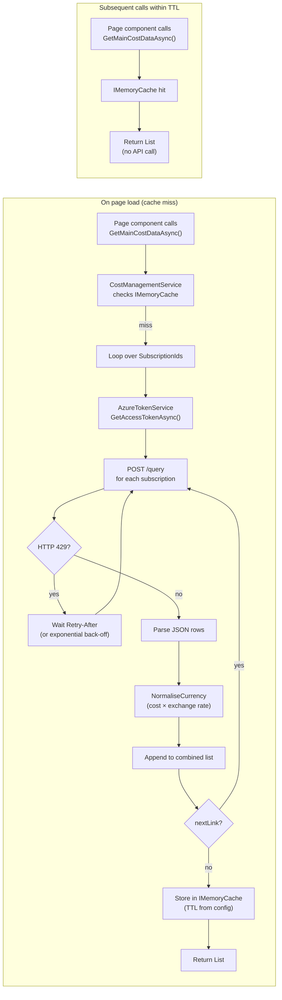
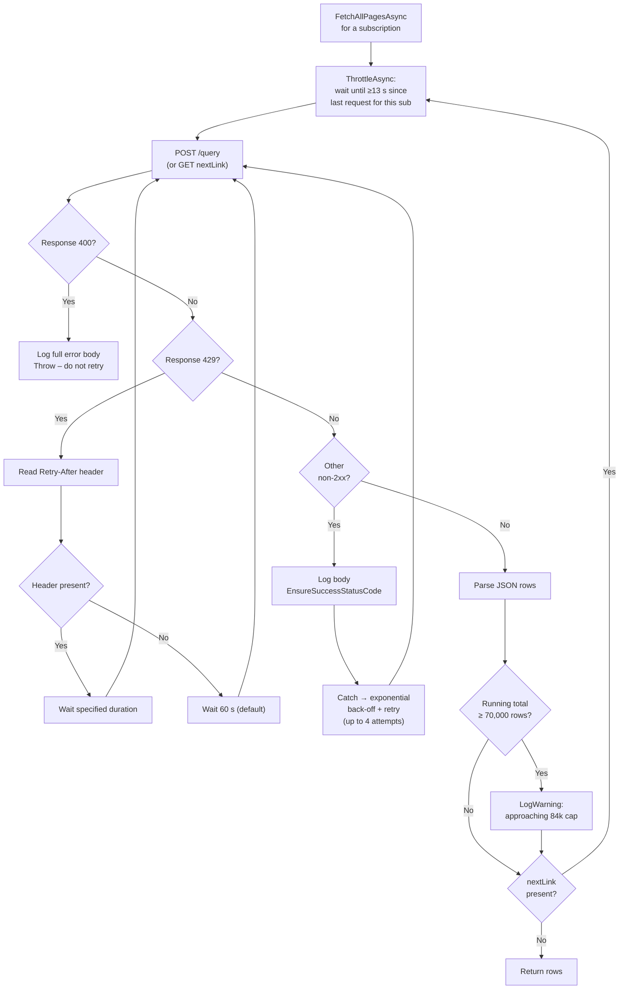
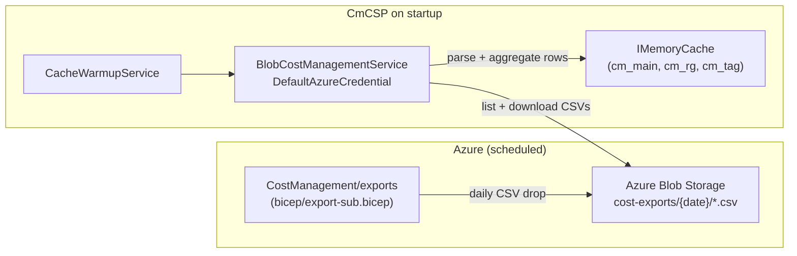
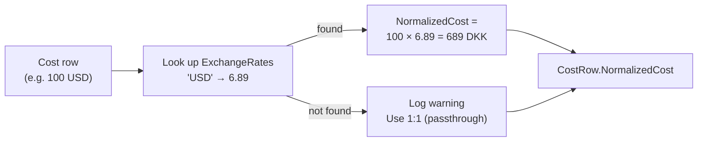
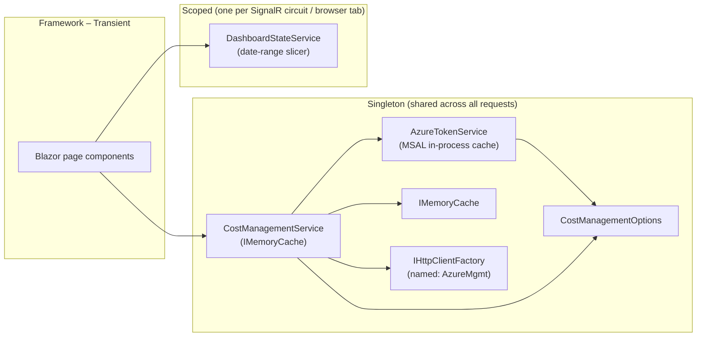

# CmCSP – Azure CSP Cost Dashboard

A **Blazor Server** web application that replaces a Power BI report with a live, interactive cost dashboard for Cloud Solution Provider (CSP) scenarios. It queries the **Azure Cost Management REST API** directly across multiple subscriptions, normalises costs to a configurable target currency, and caches results to respect API rate limits.

The dashboard mirrors the seven pages from the [TD SYNNEX tds_cc reference report](https://github.com/tdsnxnielsen-mikkelbach/tds_cc), implemented with **MudBlazor** for the UI shell and **Blazor-ApexCharts** for charts.

---

## Table of Contents

1. [Architecture](#architecture)
2. [Project Structure](#project-structure)
3. [Prerequisites](#prerequisites)
4. [Getting Started](#getting-started)
5. [Configuration Reference](#configuration-reference)
6. [Azure Role Assignments](docs/azure-roles.md)
7. [CSP Deployment Guide](docs/csp-deployment-guide.md)
8. [Authentication & Security](#authentication--security)
9. [Data Flow](#data-flow)
10. [Caching & Rate Limiting](#caching--rate-limiting)
11. [Blob Exports (Production)](#blob-exports-production)
12. [Currency Normalisation](#currency-normalisation)
13. [Dashboard Pages](#dashboard-pages)
14. [Service Registration](#service-registration)
15. [Deployment Notes](#deployment-notes)

---

## Architecture



---

## Project Structure

```
CmCSP/
├── .gitignore
├── README.md
├── appsettings.json                      ← base config (no secrets)
├── appsettings.Development.json          ← local overrides (git-ignored)
├── CmCSP.csproj
├── CmCSP.sln
├── GlobalUsings.cs                       ← Color/Align aliases (MudBlazor wins)
├── Program.cs                            ← DI registrations + HTTP pipeline
├── Properties/
│   └── launchSettings.json
├── Models/
│   ├── CostManagementOptions.cs          ← strongly-typed config section
│   ├── CostRow.cs                        ← one normalised cost record
│   └── CostApiResponse.cs               ← Azure API response shapes
├── Services/
│   ├── AzureTokenService.cs              ← MSAL client-credentials flow
│   ├── ICostManagementService.cs
│   ├── CostManagementService.cs          ← Query API: fetch / cache / normalise / retry
│   ├── BlobCostManagementService.cs      ← Blob Export: read CSVs from storage account
│   ├── AzureStorageCacheService.cs       ← Table+Blob cache (wraps IMemoryCache)
│   ├── DataLoadingStateService.cs        ← tracks per-dataset load phase for the UI
│   ├── CacheWarmupService.cs             ← background pre-warm on startup
│   └── DashboardStateService.cs         ← shared date-range slicer (Scoped)
├── Components/
│   ├── App.razor                         ← HTML shell (MudBlazor + ApexCharts JS)
│   ├── _Imports.razor                    ← global Razor usings + type aliases
│   ├── Routes.razor
│   ├── Layout/
│   │   ├── MainLayout.razor              ← MudLayout, AppBar, Drawer, dark mode
│   │   ├── NavMenu.razor                 ← 7 MudNavLinks
│   │   └── ReconnectModal.razor
│   ├── Pages/
│   │   ├── Home.razor                    ← Page 1: Cost Overview
│   │   ├── Budgets.razor                 ← Page 2: Budgets
│   │   ├── SubscriptionBreakdown.razor   ← Page 3: Subscription Breakdown
│   │   ├── ResourceGroupBreakdown.razor  ← Page 4: Resource Group Breakdown
│   │   ├── TagChargeback.razor           ← Page 5: Tag Chargeback
│   │   ├── TrendAndForecast.razor        ← Page 6: Trend & Forecast
│   │   ├── MoMWaterfall.razor            ← Page 7: MoM Waterfall
│   │   ├── Error.razor
│   │   └── NotFound.razor
│   └── Shared/
│       └── LoadingStatus.razor           ← data-load progress banner
├── bicep/
│   ├── main.bicep                        ← export storage account + Table Storage + role assignments
│   ├── app.bicep                         ← Container App, ACR, Key Vault, Log Analytics (app RG)
│   ├── export-sub.bicep                  ← subscription-scope export (managed identity)
│   └── export-billing.bicep             ← billing-account-scope export (SAS token)
├── docs/
│   ├── azure-roles.md                   ← RBAC guide for all identities
│   └── csp-deployment-guide.md         ← step-by-step deployment guide for CSPs
└── wwwroot/
    └── app.css
```

---

## Prerequisites

| Requirement | Minimum version |
|---|---|
| .NET SDK | 10.0 |
| Azure subscription(s) | With `Cost Management Reader` assigned to the service principal |
| Microsoft Entra ID | App registration with a client secret |
| *(Blob mode only)* Azure Storage account | Created by `bicep/main.bicep` |
| *(Blob mode only)* Cost Management Export | Created by `bicep/export-sub.bicep` or `export-billing.bicep` |

See [docs/azure-roles.md](docs/azure-roles.md) for the exact role assignments required for each mode.

---

## Getting Started

### 1 – Clone and restore

```bash
git clone <your-repo-url>
cd CmCSP
dotnet restore
```

### 2 – Create an Entra app registration

1. Go to **Azure Portal → Microsoft Entra ID → App registrations → New registration**
2. Name it (e.g. `cmcsp-dashboard`), single-tenant, no redirect URI needed
3. Copy the **Application (client) ID** and **Directory (tenant) ID**
4. Under **Certificates & secrets**, create a new **Client secret** and copy the value immediately
5. For each subscription, open **Access control (IAM)** and assign **Cost Management Reader** to the app

### 3 – Set local secrets with dotnet user-secrets

`dotnet user-secrets` stores credentials in your OS user profile (`%APPDATA%\Microsoft\UserSecrets\` on Windows, `~/.microsoft/usersecrets/` on Linux/macOS) — completely outside the repository. They are never committed to git.

**Step 1 – Initialise the secrets store** (one-time per project):

```bash
cd CmCSP
dotnet user-secrets init
```

You will see output like:
```
Set UserSecretsId to '<guid>' for MSBuild project 'CmCSP.csproj'.
```

**Step 2 – Set each secret** (replace the placeholder values):

```bash
dotnet user-secrets set "AzureCostManagement:TenantId"          "<your-entra-tenant-id>"
dotnet user-secrets set "AzureCostManagement:ClientId"          "<your-app-client-id>"
dotnet user-secrets set "AzureCostManagement:ClientSecret"      "<your-client-secret>"
dotnet user-secrets set "AzureCostManagement:SubscriptionIds:0" "<subscription-id-1>"
dotnet user-secrets set "AzureCostManagement:SubscriptionIds:1" "<subscription-id-2>"
```

Add as many `SubscriptionIds:N` entries as needed (0-based index).

**Step 3 – Verify** the keys were saved (values are shown in plain text locally):

```bash
dotnet user-secrets list
```

Expected output:
```
AzureCostManagement:TenantId          = f8e9efa8-...
AzureCostManagement:ClientId          = 423c9464-...
AzureCostManagement:ClientSecret      = RxH8Q~...
AzureCostManagement:SubscriptionIds:0 = ba99b95e-...
```

**How configuration layering works at runtime:**

```
appsettings.json          (base – committed, no secrets)
  ↓ overrides
appsettings.Development.json  (dev tweaks – committed, no secrets)
  ↓ overrides
dotnet user-secrets       (local machine only – never committed)
  ↓ overrides
Environment variables     (CI / production)
```

**To remove a secret:**

```bash
dotnet user-secrets remove "AzureCostManagement:ClientSecret"
```

**To clear all secrets for this project:**

```bash
dotnet user-secrets clear
```

### 4 – Run

```bash
dotnet run
```

Open `https://localhost:7xxx` (the exact port is shown in terminal output).

---

## Configuration Reference

All settings live under the `AzureCostManagement` section in `appsettings.json`. Sensitive values must be supplied via `dotnet user-secrets` (development) or environment variables / Azure Key Vault (production).

| Key | Type | Default | Description |
|---|---|---|---|
| `TenantId` | string | — | Entra Directory (tenant) ID |
| `ClientId` | string | — | App registration Application ID |
| `ClientSecret` | string | — | **Use user-secrets or Key Vault – never commit** |
| `SubscriptionIds` | string[] | `[]` | List of subscription IDs to query |
| `TargetCurrency` | string | `DKK` | ISO 4217 currency code all costs are normalised to |
| `ExchangeRates` | object | see below | Map of `"CURRENCY": rate` where rate = target units per 1 source unit |
| `CacheExpirationMinutes` | int | `60` | How long API results are kept in memory |
| `MonthlyBudget` | decimal | `125000` | Monthly budget in `TargetCurrency` for the Budgets page |
| `ApiVersion` | string | `2025-03-01` | Azure Cost Management API version |

Default exchange rates (override in `appsettings.json` or user-secrets):

```json
"ExchangeRates": {
  "USD": 6.89,
  "EUR": 7.46,
  "GBP": 8.72,
  "SEK": 0.67,
  "NOK": 0.65
}
```

---

## Authentication & Security



**Security practices applied:**

- `ClientSecret` is never present in source-controlled files (`appsettings.Development.json` is git-ignored)
- `AzureTokenService` is registered as **Singleton** — MSAL's internal cache handles token renewal automatically
- The named `HttpClient` (`"AzureMgmt"`) has a 90-second timeout; no ambient credentials are stored on it — the bearer token is added per-request
- Roles follow least-privilege: **Cost Management Reader** only (read-only)

---

## Data Flow



### Three independent datasets

| Cache key | API grouping | Used by pages |
|---|---|---|
| `cm_main` | SubscriptionName + MeterCategory | Cost Overview, Budgets, Subscriptions, Trend, MoM |
| `cm_rg` | SubscriptionName + ResourceGroupName | Resource Group Breakdown |
| `cm_tag` | SubscriptionName + TagKey | Tag Chargeback |

Calling `CostManagementService.InvalidateCache()` clears all three keys, forcing a fresh API fetch on the next request.

---

## Caching & Rate Limiting

### Azure Cost Management API hard limits

Source: [learn.microsoft.com/azure/cost-management-billing/costs/manage-automation](https://learn.microsoft.com/azure/cost-management-billing/costs/manage-automation)

| Limit | Value | Effect if exceeded |
|---|---|---|
| Requests per minute per subscription (`/query`) | **5** | HTTP 429 + `Retry-After` header |
| Date range – daily granularity | **365 days** | HTTP 400 Bad Request |
| Date range – monthly granularity | **12 months** | HTTP 400 Bad Request |
| Response payload | **~84,000 rows** | Overflow delivered via `nextLink` pagination |

### How the service handles each limit



### Request pacing (`ThrottleAsync`)

Before every API call (including pagination), the service checks how long ago the last request was dispatched for that subscription. If less than **13 seconds** have elapsed it sleeps the difference.

- **5 req/min = 1 req per 12 s**; 13 s gives a comfortable margin.
- The gate is per-subscription, so multiple subscriptions run concurrently without interfering with each other.
- Pacing only fires during a cold-cache fill. Cache hits (the common case) bypass it entirely.

### Date range

The query window is always **today − 364 days → today** (exactly 365 days inclusive). This is the maximum the API accepts for daily granularity and is enforced by the `MaxQueryDays = 365` constant in `CostManagementService`.

### 400 Bad Request detection

HTTP 400 indicates a malformed or out-of-range query — retrying will not help. The service:

1. Reads and logs the full response body at `Error` level so you can see the Azure error message.
2. Throws `InvalidOperationException` immediately (caught and re-thrown before the retry loop).
3. The outer `FetchAllPagesAsync` catches and logs the exception, then skips that subscription rather than crashing the whole dashboard.

### Cache

| Parameter | Value | Location |
|---|---|---|
| Cache TTL (development) | 5 minutes | `appsettings.Development.json` |
| Cache TTL (production) | 60 minutes | `appsettings.json` |
| Cache keys | `cm_main`, `cm_rg`, `cm_tag` | `CostManagementService` constants |
| Max retries per request | 4 | `CostManagementService.MaxRetries` |
| Default rate-limit wait | 60 seconds | `CostManagementService.DefaultRetryDelay` |
| Exponential back-off base | 2^attempt seconds | Non-429 transient errors |
| Minimum request interval | 13 seconds | `CostManagementService.MinRequestInterval` |
| Row cap warning threshold | 70,000 rows | `CostManagementService.RowCapWarning` |

---

## Blob Exports (Production)

The Blob Export mode is an alternative to the Query API that eliminates rate limits and is the recommended approach for production deployments.

### How it works



### Switching to blob mode

1. Deploy the storage infrastructure:
   ```bash
   az deployment group create \
     --resource-group rg-cmcsp-app \
     --template-file bicep/main.bicep \
     --parameters storageAccountName=cmcspcostexports
   ```
2. Deploy the export schedule per subscription:
   ```bash
   az deployment sub create \
     --location swedencentral \
     --template-file bicep/export-sub.bicep \
     --parameters exportName=daily-cost-export \
       storageAccountResourceId="<id>" \
       recurrenceFrom="2026-01-01T02:00:00Z"
   ```
3. Grant the export managed identity `Storage Blob Data Contributor` (see step 3 in [docs/azure-roles.md](docs/azure-roles.md)).
4. Grant the application identity `Storage Blob Data Reader` on the storage account.
5. Set configuration (via user-secrets locally, environment variables in production):
   ```
   AzureCostManagement:ExportBlob:Enabled          = true
   AzureCostManagement:ExportBlob:StorageAccountUri = https://<account>.blob.core.windows.net
   ```

### Configuration keys

| Key | Description |
|---|---|
| `ExportBlob:Enabled` | `true` = use blobs, `false` (default) = use Query API |
| `ExportBlob:StorageAccountUri` | Full URI of the storage account; uses `DefaultAzureCredential` |
| `ExportBlob:ConnectionString` | Alternative to URI; use user-secrets only |
| `ExportBlob:ContainerName` | Blob container name (default: `cost-exports`) |
| `ExportBlob:BlobPrefix` | Root folder path inside the container (default: `exports`) |

### Comparison with Query API mode

| | Query API | Blob Exports |
|---|---|---|
| Rate limit | 5 req/min per subscription | None |
| Data freshness | Same (both lag 8–24 h behind billing) | Same |
| Historic depth | 365 days per request | All accumulated files |
| Secrets required | `ClientSecret` | None (managed identity) |
| Infrastructure | None | Storage account + export resource |

---

## Currency Normalisation

The Cost Management API returns costs in each subscription's **billing currency**, which may differ between subscriptions (USD, EUR, GBP, etc.). Every `CostRow` has two cost fields:

| Field | Description |
|---|---|
| `Cost` | Raw value in the original billing currency |
| `Currency` | ISO 4217 code returned by the API (e.g. `"USD"`) |
| `NormalizedCost` | Cost converted to `TargetCurrency` using the exchange rate table |

All charts and cards display `NormalizedCost`. If a currency is encountered that has no configured exchange rate, a warning is logged and a 1:1 rate is used — update `ExchangeRates` in `appsettings.json` to fix this.



---

## Dashboard Pages

### Page 1 – Cost Overview (`/`)

| Visual | Type | Data source |
|---|---|---|
| Total Cost (selected range) | KPI card | `cm_main` |
| Cost MTD | KPI card | `cm_main` |
| Cost YTD | KPI card | `cm_main` |
| Avg Daily Cost | KPI card | `cm_main` |
| Current vs Prior Month | Dual-line ApexChart | `cm_main` grouped by day |
| Monthly Cost Trend | Bar ApexChart | `cm_main` grouped by month |
| Top 10 Services | Horizontal bar ApexChart | `cm_main` grouped by MeterCategory |

**Date filter:** responds to global `DashboardStateService.SelectedRange`.

---

### Page 2 – Budgets (`/budgets`)

| Visual | Type | Data source |
|---|---|---|
| Monthly Budget | KPI card | `CostManagementOptions.MonthlyBudget` |
| Spend MTD | KPI card | `cm_main` |
| Budget Variance | KPI card (red/green conditional) | `SpendMTD − Budget` |
| Budget Variance % | KPI card | `(SpendMTD − Budget) / Budget` |
| Spend vs Budget | Radial bar (gauge) | MTD spend as % of budget |
| Monthly Spend vs Budget | Grouped bar + budget line | Last 6 months |

To change the budget target, update `MonthlyBudget` in `appsettings.json` (or `appsettings.Development.json` locally).

---

### Page 3 – Subscription Breakdown (`/subscriptions`)

| Visual | Type | Data source |
|---|---|---|
| Total Cost | KPI card | `cm_main` |
| Subscription count | KPI card | distinct `SubscriptionName` |
| Largest share % | KPI card | top subscription share |
| Cost by Subscription | Horizontal bar ApexChart | `cm_main` per subscription |
| Cost Share | Donut ApexChart | `cm_main` per subscription |
| Subscription Reference | MudDataGrid | ID, Name, Total, MTD, Share % |

---

### Page 4 – Resource Group Breakdown (`/resource-groups`)

| Visual | Type | Data source |
|---|---|---|
| Total Cost | KPI card | `cm_rg` |
| Resource group count | KPI card | `cm_rg` |
| Avg Monthly Cost (top 15) | KPI card | `cm_rg` |
| Top 15 Resource Groups | Horizontal bar ApexChart | `cm_rg` top 15 by cost |
| Details table | MudDataGrid | Name, Total, MTD, Share % |

---

### Page 5 – Tag Chargeback (`/tags`)

| Visual | Type | Data source |
|---|---|---|
| Total Tagged Cost | KPI card | `cm_tag` (non-empty TagKey) |
| Untagged Cost | KPI card | `cm_tag` (empty TagKey) |
| Distinct Tag Keys | KPI card | `cm_tag` |
| Cost Distribution by Tag | Vertical bar ApexChart | `cm_tag` |
| Tag Cost Ranked | Horizontal bar ApexChart | `cm_tag` |
| Tag Reference Table | MudDataGrid | Tag, Total Cost, Share % |

> **Note:** The API groups by `TagKey` (key names only). Tag values are not included in this grouping level.

---

### Page 6 – Trend & Forecast (`/trend`)

| Visual | Type | Data source |
|---|---|---|
| Cost MTD | KPI card | `cm_main` |
| Month-End Forecast | KPI card | `(MTD / daysElapsed) × daysInMonth` |
| Rolling 3-Month Avg | KPI card | last 3 calendar months |
| YoY Change % | KPI card | current year vs prior year |
| Actual vs Forecast (daily) | Dual-line ApexChart | actual daily + projected remaining |
| Monthly + Rolling 3M Avg | Grouped bar + line ApexChart | `cm_main` monthly |
| YoY Comparison | Dual-line ApexChart | current year vs prior year by month |
| Global date slicer | MudDateRangePicker | broadcasts to all pages |

**Forecast method:** simple linear extrapolation — `averageDailySpend × daysInMonth`. This gives a sensible first-order estimate without requiring historical ML models.

---

### Page 7 – MoM Waterfall (`/waterfall`)

| Visual | Type | Data source |
|---|---|---|
| MoM Change | KPI card | `currentMonth − priorMonth` |
| MoM Change % | KPI card | `(currentMonth − priorMonth) / priorMonth` |
| YoY Change % | KPI card | same calendar month, prior year |
| Current Month Spend | KPI card | `cm_main` |
| MoM Cost Change (bar) | Bar ApexChart (green/red) | monthly delta series |
| MoM Change by Subscription | Horizontal bar (green/red) | current vs prior month per subscription |
| Monthly Summary | MudDataGrid | Month, Total, Change, Change % |
| Global date slicer | MudDateRangePicker | broadcasts to all pages |

---

## Service Registration



**Why Singleton for `CostManagementService`?**  
`IMemoryCache` and `IHttpClientFactory` are both Singleton-safe. Making the cost service Singleton means the cache is truly shared across all browser sessions — one API call per cache TTL regardless of how many users are connected.

**Why Scoped for `DashboardStateService`?**  
Each browser tab has its own SignalR circuit. Scoping the state service to the circuit means each tab's date-range filter is independent.

---

## Deployment Notes

### Environment variables (production)

Supply secrets via environment variables instead of `appsettings.Development.json`:

```bash
AzureCostManagement__TenantId=<value>
AzureCostManagement__ClientId=<value>
AzureCostManagement__ClientSecret=<value>
AzureCostManagement__SubscriptionIds__0=<sub-id-1>
AzureCostManagement__SubscriptionIds__1=<sub-id-2>
```

ASP.NET Core maps double-underscore (`__`) to the colon (`:`) separator in configuration keys.

### Azure Key Vault (recommended for production)

Add the `Azure.Extensions.AspNetCore.Configuration.Secrets` NuGet package and register Key Vault as a configuration provider in `Program.cs`. Map `AzureCostManagement--ClientSecret` (double dash = Key Vault separator convention) to the config path.

### Docker

```dockerfile
FROM mcr.microsoft.com/dotnet/aspnet:10.0 AS base
WORKDIR /app
EXPOSE 8080

FROM mcr.microsoft.com/dotnet/sdk:10.0 AS build
WORKDIR /src
COPY ["CmCSP.csproj", "."]
RUN dotnet restore
COPY . .
RUN dotnet publish -c Release -o /app/publish

FROM base AS final
WORKDIR /app
COPY --from=build /app/publish .
ENTRYPOINT ["dotnet", "CmCSP.dll"]
```

Pass secrets as environment variables to the container — never bake them into the image.

### Azure Container Apps / App Service

Set environment variables under **Configuration → Application settings** in the Azure portal. Enable the managed identity and grant it `Cost Management Reader` on the subscriptions to eliminate the need for a client secret entirely (use `DefaultAzureCredential` from `Azure.Identity` instead of MSAL client-credentials).

---

## NuGet Packages

| Package | Purpose |
|---|---|
| `MudBlazor` | UI component library (layout, cards, data grids, navigation, date pickers) |
| `Blazor-ApexCharts` | Interactive charts (line, bar, donut, radial bar) |
| `Microsoft.Identity.Client` | MSAL – OAuth2 client-credentials token acquisition with built-in cache |
| `Azure.Storage.Blobs` | Read cost export CSV files from Azure Blob Storage (blob mode) |
| `Azure.Identity` | `DefaultAzureCredential` – managed identity / az login for blob authentication |
