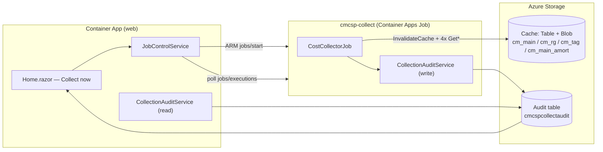

# Data Collection Job – Design & Operations

## Overview

Nightly cost-data collection runs **outside the web app** in a dedicated Azure Container Apps **Job** (`cmcsp-collect`). The job refreshes the shared two-tier cache (Table + Blob Storage) that every dashboard page reads, so figures stay current independently of the web app's lifecycle (which scales to zero when idle) and the first user of the day never pays the cold-fetch cost.

A **Job** (not a second Container App) is the right primitive: collection is run-to-completion, isolated from web traffic, and billed per execution.

| Concern | Where | Trigger |
|---|---|---|
| **Scheduled collection** | `cmcsp-collect` Container Apps Job | Nightly cron `0 2 * * *` (02:00 UTC) |
| **On-demand collection** | Same job, started via ARM `jobs/start` | Dashboard **Collect now** button |
| **Last-run status** | `CollectionAuditService` → Table Storage | Written at the end of every run |

> Replaces the retired in-process `DailyApiRefreshService` hosted service.

---

## Architecture



The job reuses the **exact same cost + cache pipeline** as the web app via the shared `CmCSP.Core` class library, so cache keys, TTLs and the 60 KB Table/Blob routing stay identical — there is no risk of the job and the app disagreeing about cache layout.

---

## Schedule & Triggers

The job resource is `triggerType: 'Schedule'`, but a Schedule-triggered job can still be started manually through the `jobs/start` API, so a **single job resource serves both paths**.

| Trigger | Mechanism | `COLLECT_TRIGGER` | Notes |
|---|---|---|---|
| **Schedule** | `cronExpression: '0 2 * * *'` | `schedule` | Nightly at 02:00 UTC |
| **Manual** | ARM `Microsoft.App/jobs/start` from `JobControlService` | `manual` | Overridden on UI-started executions; recorded in the audit row |

Other schedule settings:

```
replicaTimeout:         1800   # 30 min — collection across many subscriptions can be slow
replicaRetryLimit:      1
parallelism:            1      # see Concurrency below
replicaCompletionCount: 1
```

---

## What the Job Does

1. Builds the same DI container as the web app (cost services + cache + `SubscriptionStoreService`, which merges user-added subscription IDs from Key Vault).
2. Calls `ICostManagementService.InvalidateCache()` so the next fetch re-reads exports / re-queries instead of returning stale cache.
3. Fetches the **four aggregate datasets sequentially**, repopulating the cache:
   - `cm_main` — `GetMainCostDataAsync()`
   - `cm_rg` — `GetRgCostDataAsync()`
   - `cm_tag` — `GetTagCostDataAsync()`
   - `cm_main_amort` — `GetAmortizedMainCostDataAsync()`
4. Writes an **audit row** (status, counts, trigger, duration, replica, correlation id).
5. Exits `0` on success, `1` on failure.

In the production blob-export path there is **no API rate limit** (the job reads pre-built export CSVs). The Query-API fallback (used before the first export lands) honours the **5 requests/minute per-subscription** Cost Management limit.

---

## Idempotency & Concurrency

- **Idempotent by design.** Each run does `InvalidateCache()` then a full repopulate. Running it twice produces the same cache state; there is no incremental/append behaviour to corrupt.
- **`parallelism = 1` (single replica).** The cache keys (`cm_main`, `cm_rg`, `cm_tag`, `cm_main_amort`) are **aggregated across all subscriptions**. A second concurrent replica would race to write the same keys, so collection runs as one replica refreshing the aggregate datasets.
- **Coalescing for UI callers.** `JobControlService.StartOrCoalesceAsync` checks for an in-flight execution first; if one is already `Running`/`Processing`, it **joins that execution** instead of starting another. Many users clicking *Collect now* at once all observe the single in-progress run.

> **Follow-up (P3):** true per-replica **per-subscription partitioning** (`parallelism > 1`) would require introducing per-subscription cache keys first. Tracked in [todo.md](todo.md).

---

## Identity & RBAC

The job runs with its own **SystemAssigned Managed Identity** for runtime access; image pulls use the shared user-assigned `acrPullIdentity` (granted AcrPull up-front to avoid first-deploy registry-validation hangs).

### Job identity (`cmcsp-collect`)

| Role | Scope | Granted in | Purpose |
|---|---|---|---|
| Key Vault Secrets User | Key Vault | `app.bicep` | Read `CmCSP--ClientSecret` (Query API fallback) |
| Storage Blob Data Reader | Storage account | `main.bicep` | Read cost-export CSVs |
| Storage Blob Data Contributor | `cmcspcache` container | `main.bicep` | Write large (> 60 KB) cache payloads |
| Storage Table Data Contributor | Storage account | `main.bicep` | Write cache rows **and audit rows** |

### App identity → start the job

No built-in role grants only `Microsoft.App/jobs/start`, so a tightly-scoped **custom role** is defined and assigned to the **Container App** managed identity, scoped to the collect job only:

```
Role: "CmCSP Collect Job Operator (<appName>)"
actions:
  - Microsoft.App/jobs/read
  - Microsoft.App/jobs/start/action
  - Microsoft.App/jobs/executions/read
```

This lets the dashboard **Collect now** button start the job and poll execution status without broad Container Apps management rights.

---

## Audit Table

`CollectionAuditService` (in `CmCSP.Core`) reads and writes the run history. It reuses the **cache storage account** (`AzureCache:StorageAccountUri`) but a dedicated table so audit rows never collide with cache entries.

| Property | Value |
|---|---|
| Table name | `cmcspcollectaudit` |
| Partition key | `collect` |
| Row key | `{reverse-ticks}_{correlationId}` (newest sorts first) |

### Row fields

| Field | Meaning |
|---|---|
| `Status` | `Success` / `Failed` |
| `Trigger` | `schedule` / `manual` |
| `StartedUtc`, `FinishedUtc`, `DurationMs` | Run timing |
| `SubscriptionCount` | Subscriptions in scope |
| `MainRows`, `RgRows`, `TagRows`, `AmortRows` | Per-dataset row counts |
| `Error` | Failure detail (null on success) |
| `ReplicaName` | Container Apps replica (cross-reference logs) |
| `CorrelationId` | Ties the audit row to the job's log lines |

The dashboard reads the latest row (`GetLatestAsync`) for instant last-run status — no Log Analytics ingestion-latency wait. `IsEnabled` is `false` (writes/reads become no-ops) when `AzureCache` is not configured.

---

## On-Demand Collection (UI)

The **Data Collection** panel on the Home page wires the button to `JobControlService`:

1. `StartOrCoalesceAsync()` → ARM `jobs/start` (or coalesce onto an in-flight run) using the app MI (`DefaultAzureCredential`).
2. The UI polls `GetLatestAsync()` every 5 s (bounded to ~3.5 min so it doesn't hold the SignalR circuit) until the execution leaves an in-progress state.
3. On completion it reloads the audit row and shows status / counts / duration, plus a **portal deep link** to the job's execution history for raw logs.

Coordinates are injected as Container App env vars (`CollectorJob__SubscriptionId`, `CollectorJob__ResourceGroup`, `CollectorJob__JobName`). When unset, the button is disabled and the panel shows an informational note.

---

## Deployment

### First-time (`azd provision`)

`app.bicep` provisions the `cmcsp-collect` job (placeholder image), the custom operator role and its assignment. `main.bicep` grants the job MI its storage roles using the output principal ID. The `postprovision` hook wires the cost + cache environment variables onto the job (same set as the Container App).

### Image update (`azd deploy`)

The `postdeploy` hook (`infra/hooks/postdeploy.ps1`) builds the collector job image, sharing one ACR token + Docker-config setup:

1. `src/CostCollectorJob/CostCollectorJob.csproj` → `<acr>/cmcsp-collect:<tag>`

Each image is built with `dotnet publish /t:PublishContainer` (no Dockerfile), pushed to ACR, and the job updated to the new digest.

```pwsh
azd deploy
```

---

## Configuration Reference

The job reads the same `AzureCostManagement__*` variables as the web app, set by the `postprovision` hook:

| Variable | Default | Description |
|---|---|---|
| `COLLECT_TRIGGER` | `schedule` | `schedule` / `manual`; recorded in the audit row |
| `KeyVaultUri` | *(set in bicep)* | Key Vault for `CmCSP--ClientSecret` + user-added subscription IDs |
| `AzureCostManagement__TenantId` / `ClientId` / `ClientSecret` | *(hook / Key Vault)* | Cost Management Query API fallback |
| `AzureCostManagement__ExportBlob__*` | *(hook)* | Blob export source (no rate limit) |
| `AzureCostManagement__AzureCache__StorageAccountUri` | *(hook)* | Cache **and** audit storage account |
| `AzureCostManagement__AzureCache__TableName` | `cmcspcache` | Cache table (audit uses `cmcspcollectaudit`) |
| `AzureCostManagement__AzureCache__CacheContainerName` | `cmcspcache` | Blob container for large payloads |

---

## Monitoring

Job executions are visible in **Log Analytics** under the shared `<appName>-logs` workspace. Each run logs its correlation id:

```
CostCollector[<correlationId>]: starting <trigger> collection for <n> subscription(s) on replica <replica>.
CostCollector[<correlationId>]: collection complete. main=.., rg=.., tag=.., amort=..
CostCollector[<correlationId>]: <Status> in <ms> ms (trigger=<trigger>).
```

Query recent executions:

```kusto
ContainerAppConsoleLogs_CL
| where ContainerName_s == "cmcsp-collect"
| order by TimeGenerated desc
| project TimeGenerated, Log_s
```

For last-run status at a glance, the dashboard's **Data Collection** panel reads the audit table directly — no query required.
