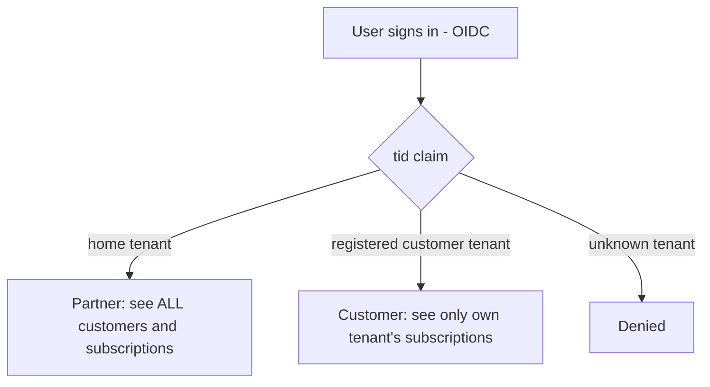

# Phase 9 — CSP multi-tenancy (design)

Phase 9 turns the single-tenant, multi-subscription dashboard into a **CSP product** a
reseller can offer their customers. Each customer's Azure data is isolated and read
cross-tenant; **who you are when you sign in decides what you see.**

- **CSP (home-tenant) user** → sees **all** customers and **all** subscriptions.
- **Customer-tenant user** → sees **only** the subscriptions that belong to **their own**
  tenant.

**Everything stays Azure-only and managed-identity / delegated-token based.** Explicitly
**out of scope**: `api.partnercenter.microsoft.com` (no Partner Center API), and any
Microsoft 365 / Microsoft Graph license data. Cross-customer billing aggregation, if ever
needed, uses the **ARM Cost Management billing-account / customer scopes** that
[`CostDetailsService`](../src/Services/CostDetailsService.cs) already supports — not Partner
Center.

> Status: 📋 Planned (design only). This document is the first increment; the data-model,
> auth, and isolation changes below are gated follow-on steps tracked in
> [`docs/todo.md`](todo.md) under **Phase 9**.

---

## Why this change

Today the app is **single-tenant, multi-subscription**:

- Sign-in is Entra OIDC bound to one tenant
  ([`Program.cs`](../src/Program.cs) `AddMicrosoftIdentityWebAppAuthentication` with the
  configured `AzureCostManagement:TenantId`).
- Cost is read for a flat **list of subscription IDs**
  ([`CostManagementOptions.SubscriptionIds`](../src/CmCSP.Core/Models/CostManagementOptions.cs)
  + the `UserSubscription` SQL table).
- One identity ([`AzureTokenService`](../src/CmCSP.Core/Services/AzureTokenService.cs))
  acquires tokens in that **one** tenant.

A CSP serving their own customers needs (a) customers to sign in from **their** tenant and
see **only** their data, and (b) the partner to see **everything** — across tenant
boundaries — from a single pane of glass.

The foundation is already friendly to this: `SubscriptionId` is part of the `CostFact`
**natural key**, `ICacheService` keys are prefixable, and billing-scope code already exists.
This is an **extension, not a teardown**.

---

## Personas & visibility model

| Persona | Signs in from | Sees | How it's decided |
|---|---|---|---|
| **Partner admin** | CSP **home** tenant | All customers, all tenants, all subscriptions | Token `tid` == configured home tenant |
| **Partner operator** (optional) | CSP home tenant | A configurable subset of customers | Home tenant + app-role / group claim |
| **Customer user** | **Their own** customer tenant | Only subscriptions mapped to **their** tenant | Token `tid` == a known customer tenant |
| **Unknown tenant** | Any other tenant | Nothing — access denied | `tid` not home and not a registered customer |

The decisive signal is the **`tid` (tenant ID) claim** on the signed-in user's token. The
home tenant ID is configuration the app trusts; every other `tid` must match a **registered
customer** or sign-in is rejected.



---

## Data model

Extend the Phase 4 EF Core context
([`CmcspDbContext`](../src/CmCSP.Core/Data/CmcspDbContext.cs)) and
[`infra/sql/schema.sql`](../infra/sql/schema.sql). All additions are **additive** — the
existing `CostFact` natural key is preserved and simply gains a tenant dimension.

### `Customer` — a reseller's customer

| Column | Type | Notes |
|---|---|---|
| `Id` | `bigint` identity | surrogate PK |
| `TenantId` | `nvarchar(36)` | the customer's Entra **tenant** GUID — the sign-in `tid` and token authority |
| `DisplayName` | `nvarchar(256)` | friendly customer name shown in the picker |
| `Status` | `nvarchar(16)` | `active` / `suspended` (gates sign-in + collection) |
| `GdapRelationshipId` | `nvarchar(128)` null | the GDAP relationship granting delegated access |
| `CreatedUtc` | `datetime2` | onboarding timestamp |

Unique index on `TenantId`.

### `CustomerSubscription` — which subscriptions belong to a customer

Replaces / generalises the flat `UserSubscription` list with a tenant-scoped mapping.

| Column | Type | Notes |
|---|---|---|
| `Id` | `bigint` identity | surrogate PK |
| `CustomerId` | `bigint` FK → `Customer` | owning customer |
| `SubscriptionId` | `nvarchar(36)` | Azure subscription GUID |
| `SubscriptionName` | `nvarchar(256)` | cached display name |
| `AddedUtc` | `datetime2` | |

Unique index on `(CustomerId, SubscriptionId)` and a non-unique index on `SubscriptionId`
(for the reverse lookup subscription → customer used during authorization).

### `CostFact` — add the tenant dimension

Add two columns to the existing entity:

| Column | Type | Notes |
|---|---|---|
| `CustomerId` | `bigint` | owning customer (FK), denormalised for fast filtered reads |
| `TenantId` | `nvarchar(36)` | the customer tenant — redundant with `Customer` but indexed for direct scoping |

- The **natural key stays `(Dataset, UsageDate, SubscriptionId, …, Currency)`** — a
  subscription belongs to exactly one customer, so `SubscriptionId` already disambiguates
  rows. `CustomerId` / `TenantId` are **carried for query scoping**, not added to the key.
- New index: `IX_CostFact_Customer_Dataset_UsageDate (CustomerId, Dataset, UsageDate)` —
  the dashboard's per-customer read shape.

> **Backfill:** existing `CostFact` rows are mapped to a single bootstrap "home" customer
> (the CSP's own tenant) during migration, so nothing is orphaned.

---

## Authentication — multi-tenant sign-in

The Entra **app registration becomes multi-tenant** (`signInAudience =
AzureADMultipleOrgs`). OIDC must then accept tokens issued by **any** tenant and validate
the issuer against the set of **registered** tenants rather than one hard-coded authority.

Conceptual changes in [`Program.cs`](../src/Program.cs):

- Use the **common** (or **organizations**) authority instead of a fixed `TenantId`, so
  users from any tenant can reach the sign-in page.
- Replace single-issuer validation with **`IssuerValidator`** that accepts an issuer **iff**
  its tenant is the home tenant or an `active` `Customer.TenantId`. Reject everything else
  before a session is established.
- Capture the `tid` claim into the authenticated principal so every downstream query can
  scope by it.

Customer onboarding requires the customer tenant to **consent** to the multi-tenant app
(admin consent), which is also what establishes the GDAP relationship (below).

---

## Authorization — the visibility rule

A single server-side **tenant-scope resolver** (e.g. `ITenantScopeProvider`, scoped to the
circuit) turns the signed-in `tid` into the set of customers/subscriptions the request may
read:

```text
tid == HomeTenantId            → scope = ALL active customers (partner view)
tid == some Customer.TenantId  → scope = that one customer only
otherwise                      → deny (no scope)
```

Every data read is funnelled through this scope:

- **Page queries** ([`DashboardStateService`](../src/Services/DashboardStateService.cs) and
  the cost services) take the resolved `CustomerId` set and filter `CostFact` (and budgets,
  advisor, reservations, etc.) by it. There is **no code path** that reads cost data without
  a scope.
- **Partner customer picker:** when scope = ALL, the UI shows a customer selector (and an
  "all customers" aggregate). When scope = one customer, the picker is hidden / fixed.
- **Defence in depth:** authorization is enforced **at the query layer** (server-side
  `WHERE CustomerId IN (...)`), not only in the UI — a customer cannot reach another
  tenant's data by manipulating the client.

---

## Cross-tenant data access — GDAP + per-tenant tokens

Cost (and Phase 7/8 inventory, advisor, security) data lives **inside each customer's
tenant**. The partner reads it via **GDAP (Granted Delegated Admin Privileges)** —
time-bound, least-privilege roles in the customer tenant:

- Per customer, the partner holds delegated **Reader** + **Cost Management Reader** (and, for
  later phases, **Security Reader**) — never standing global admin.
- [`AzureTokenService`](../src/CmCSP.Core/Services/AzureTokenService.cs) becomes
  **per-tenant**: instead of one fixed authority it acquires an ARM token for
  `https://login.microsoftonline.com/{customerTenantId}` for the customer being read. The
  existing MSAL confidential-client app is reused with a per-tenant authority (or
  OBO/client-credentials against each customer tenant under the GDAP grant).
- Token cache keys become `{tenantId}:{scope}` so tenants never share cached tokens.

> Why not Partner Center API? It is **explicitly excluded**. GDAP + ARM Cost Management at
> the customer/subscription scope provides all the **Azure** cost + posture data this product
> needs, without taking a dependency on Partner Center billing APIs.

---

## Cache & isolation — the critical boundary

This is the **P0** item: tenants must never read each other's cached or stored data.

- **Cache keys are tenant-prefixed.** Every key the cost services use (`cm_main`, `cm_rg`,
  `cm_tag`, `cm_main_amort`, budgets, advisor, sub-names) and every **warmup** key in
  [`CacheWarmupService`](../src/Services/CacheWarmupService.cs) gains a `{customerId}:`
  prefix, e.g. `cust_42:cm_main`. The shared L2 (Redis) and per-replica L1 therefore
  partition naturally by customer.
- **SQL reads are always scoped.** `LoadFromSqlAsync`
  ([`BlobCostManagementService`](../src/CmCSP.Core/Services/BlobCostManagementService.cs))
  and every other read add `WHERE CustomerId IN (<resolved scope>)`. The resolved scope comes
  from the server-side tenant-scope resolver — never from a client-supplied value.
- **Writes carry the customer.** The collector stamps `CustomerId` / `TenantId` on every
  `CostFact` upsert; the natural key is unchanged, so idempotent re-collection still works.

---

## Collection — per-tenant fan-out

The collector ([`CostCollectorJob`](../src/CostCollectorJob/Program.cs)) iterates
**customers/tenants**, acquiring a **per-tenant token** (via GDAP) per slice and stamping the
owning `CustomerId`. This builds directly on the **Phase 5 fan-out runbook**
([`docs/data-collection.md`](data-collection.md)): the existing
`COLLECT_PARTITION_COUNT` / `COLLECT_PARTITION_INDEX` partitioning extends from
"subscriptions" to "customers × subscriptions", and the `CostFact` natural key (which
includes `SubscriptionId`) keeps partitioned writes disjoint and conflict-free.

---

## Onboarding flow (per customer)

1. Partner adds a `Customer` row (tenant ID + display name; `status = active`).
2. Customer admin **consents** to the multi-tenant app and the partner establishes the
   **GDAP** relationship (Reader / Cost Management Reader, time-bound).
3. The app enumerates the customer's subscriptions (ARM, under the GDAP token) and populates
   `CustomerSubscription`.
4. The collector picks the customer up on its next run (or an on-demand "Collect now" scoped
   to that customer) and writes tenant-stamped `CostFact` rows.
5. Customer users can now sign in from their own tenant and see **only** their data; the
   partner sees the new customer in the picker.

---

## Migration & rollout

- **Additive schema.** New tables + two `CostFact` columns + indexes; no destructive change.
- **Bootstrap home customer.** Existing rows map to the CSP's own tenant as customer #1, so
  the current single-tenant deployment keeps working unchanged.
- **Gated.** Multi-tenant sign-in and per-tenant collection are behind a feature flag (e.g.
  `MultiTenancy:Enabled`); with it off the app behaves exactly as today (home tenant only).
- **Incremental.** Ship the data model + scoping first (still single tenant, but every read
  scoped to the bootstrap customer), then enable multi-tenant sign-in, then per-tenant GDAP
  collection.

---

## Out of scope (by decision)

- ❌ **Partner Center API** (`api.partnercenter.microsoft.com`) — not used; cross-customer
  data comes from GDAP + ARM Cost Management scopes.
- ❌ **Microsoft 365 / Microsoft Graph license data** — this product is **Azure spend +
  Azure posture only**.
- ❌ **Advisor categories other than Cost** — Advisor stays cost-focused (see Phase 8).

---

## Open questions

- **Token model under GDAP:** confirm whether client-credentials-with-per-tenant-authority or
  on-behalf-of best fits the GDAP grant for unattended (collector) vs interactive (web) reads.
- **Partner operator sub-scoping:** do we need per-operator customer subsets (app roles /
  groups), or is "home tenant = sees all" sufficient for v1?
- **GDAP expiry handling:** surface relationships nearing expiry so collection doesn't silently
  start failing for a customer.
